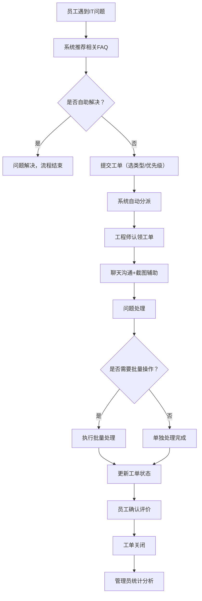

## 1. 产品概述
公司内部IT支持帮助台系统，专为内部员工IT问题设计，提供工单提交、智能推荐FAQ、工程师在线处理、批量操作和数据统计分析功能。
- 主要解决员工电脑故障、软件问题、账号申请、网络问题等IT相关诉求
- 目标用户：公司全体员工、IT工程师、系统管理员
- 核心价值：提升IT支持响应效率，减少重复问题，优化IT基础设施

## 2. 核心 Features

### 2.1 用户角色
| 角色 | 登录方式 | 核心权限 |
|------|----------|----------|
| 员工 | 域账号/SSO | 提交工单、查看历史工单、知识库自助查询、聊天沟通 |
| IT工程师 | 域账号/SSO | 认领工单、处理工单、聊天沟通、上传截图、批量处理、关闭工单 |
| 管理员 | 域账号/SSO | 全部权限、查看统计报表、管理FAQ、分配工单、系统配置 |

### 2.2 功能模块
1. **首页工作台**：工单概览、快捷提交、紧急工单提醒、待办事项
2. **工单管理**：工单列表、工单详情、创建工单、工单处理、状态流转
3. **聊天沟通**：工单内实时聊天、截图上传、文件传输
4. **FAQ知识库**：知识分类、智能搜索、提交前推荐、自助解决
5. **通知中心**：高优先级工单即时通知、状态变更通知、消息提醒
6. **批量处理**：批量重置密码、批量分配、批量关闭、批量标记
7. **统计分析**：工单数量分布、平均处理时长、高频故障类型、绩效报表

### 2.3 页面详情
| 页面名称 | 模块名称 | 功能描述 |
|----------|----------|----------|
| 首页工作台 | 数据概览 | 今日工单、待处理、已完成、平均响应时间等关键指标卡片 |
| 首页工作台 | 紧急工单 | 高优先级工单高亮展示，实时提醒 |
| 首页工作台 | 快捷操作 | 快速提交工单、查看我的工单、知识库入口 |
| 工单列表页 | 筛选查询 | 按状态、类型、优先级、时间范围筛选 |
| 工单列表页 | 工单卡片 | 展示工单标题、类型、状态、优先级、创建时间、处理人 |
| 工单详情页 | 工单信息 | 完整工单信息展示、状态流转按钮 |
| 工单详情页 | 聊天窗口 | 实时消息对话、截图上传、附件发送 |
| 工单详情页 | 处理记录 | 完整操作日志、时间线展示 |
| 创建工单页 | 表单填写 | 问题类型选择（硬件/软件/权限/网络）、优先级、紧急程度 |
| 创建工单页 | 智能推荐 | 填写时自动推荐相关FAQ，可能自助解决 |
| FAQ知识库 | 分类浏览 | 按问题类型分类展示常见问题 |
| FAQ知识库 | 智能搜索 | 全文搜索，高亮匹配内容 |
| 统计分析页 | 数据看板 | 工单数量分布图、平均处理时长趋势、高频故障类型Top10 |
| 统计分析页 | 导出报表 | 支持Excel/CSV格式导出统计数据 |
| 批量处理页 | 批量操作 | 选择多个同类工单执行批量操作 |
| 个人中心 | 账户信息 | 个人资料、通知设置、工单历史 |

## 3. 核心流程

### 3.1 员工提交工单流程
员工遇到IT问题 → 系统自动推荐相关FAQ → 尝试自助解决（可选）→ 提交工单（选择类型/优先级）→ 系统分派给IT工程师 → 工程师认领处理 → 聊天沟通/上传截图 → 问题解决 → 员工确认评价 → 工单关闭

### 3.2 工程师处理流程
查看待认领工单 → 认领工单 → 联系员工了解详情 → 聊天沟通（上传截图/操作说明）→ 解决问题（可执行批量操作）→ 更新工单状态 → 员工确认 → 工单关闭

### 3.3 Mermaid 流程图

## 4. 用户界面设计

### 4.1 设计风格
- 主色调：科技蓝 `#1677ff`，传达专业、可信赖
- 辅助色：成功绿 `#52c41a`、警告橙 `#faad14`、危险红 `#ff4d4f`
- 中性色：深灰 `#1f2937`、中灰 `#6b7280`、浅灰 `#f3f4f6`
- 按钮风格：圆角矩形，悬停有微动画，主按钮有渐变效果
- 字体：使用 "Noto Sans SC" 作为主要字体，搭配 "JetBrains Mono" 等宽字体展示代码/配置
- 布局风格：顶部导航 + 左侧菜单 + 内容区三段式布局，卡片式模块组织
- 图标风格：Ant Design 图标库，统一线性风格，高优先级工单带闪烁效果

### 4.2 页面设计概览
| 页面名称 | 模块名称 | UI 元素 |
|----------|----------|---------|
| 首页工作台 | 数据概览 | 渐变背景卡片、数字动画、趋势箭头、图标徽章 |
| 工单列表页 | 工单卡片 | 状态标签（不同颜色）、优先级角标、悬停效果、骨架屏加载 |
| 工单详情页 | 聊天窗口 | 消息气泡（区分发送方）、图片预览、时间戳、输入框带快捷操作 |
| 创建工单页 | 表单 | 分步引导、实时校验、FAQ推荐浮窗、智能补全 |
| FAQ知识库 | 知识卡片 | 展开/收起动画、相关问题推荐、点赞/收藏按钮 |
| 统计分析页 | 数据看板 | ECharts图表（饼图/折线图/柱状图）、数据下钻、时间筛选器 |

### 4.3 响应式设计
- 桌面端优先设计，支持1280px及以上分辨率
- 平板端（768px-1279px）：左侧菜单可折叠，内容区自适应
- 移动端（<768px）：底部导航，工单列表卡片化展示，聊天界面全屏

### 4.4 交互与动画
- 页面加载：骨架屏 + 渐入动画
- 工单状态变更：平滑过渡动画
- 高优先级工单：红色边框 + 轻微呼吸动画
- 聊天消息：逐条滑入动画
- 数据看板：数字滚动动画
- 悬停效果：卡片微上浮 + 阴影加深
