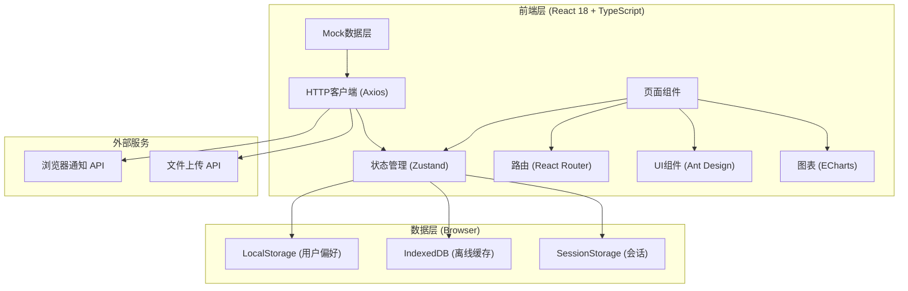
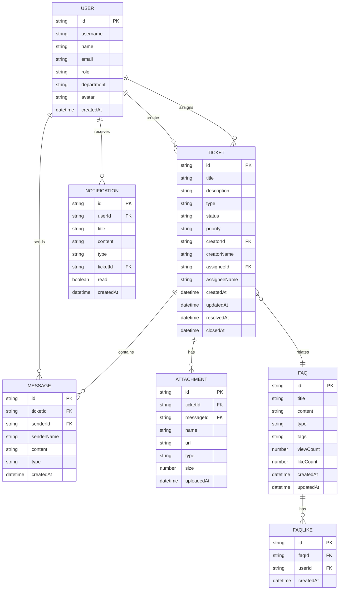

## 1. 架构设计



## 2. 技术描述

- **前端框架**: React@18.2 + TypeScript@5 + Vite@5
- **构建工具**: Vite 初始化项目
- **UI组件库**: Ant Design@5 + @ant-design/icons
- **状态管理**: Zustand@4 (轻量级状态管理)
- **路由管理**: React Router@6
- **图表库**: ECharts@5
- **HTTP客户端**: Axios@1
- **CSS框架**: TailwindCSS@3
- **日期处理**: dayjs
- **Mock数据**: MSW@2 (Mock Service Worker) + 内置mock数据
- **工具库**: uuid, lodash-es
- **后端**: 无后端，使用MSW模拟API，LocalStorage持久化
- **数据库**: LocalStorage + IndexedDB (浏览器端持久化)

## 3. 路由定义

| 路由 | 页面 | 权限要求 | 说明 |
|------|------|----------|------|
| / | 首页工作台 | 所有登录用户 | 数据概览、快捷操作、紧急工单 |
| /tickets | 工单列表 | 所有登录用户 | 工单筛选、批量操作入口 |
| /tickets/:id | 工单详情 | 工单创建人/处理人/管理员 | 工单信息、聊天窗口、处理记录 |
| /tickets/create | 创建工单 | 所有登录用户 | 表单填写、FAQ智能推荐 |
| /tickets/batch | 批量处理 | IT工程师/管理员 | 批量选择、批量操作 |
| /faq | FAQ知识库 | 所有登录用户 | 知识浏览、智能搜索 |
| /statistics | 统计分析 | 管理员 | 数据看板、报表导出 |
| /notifications | 通知中心 | 所有登录用户 | 消息列表、通知设置 |
| /profile | 个人中心 | 所有登录用户 | 个人信息、通知偏好 |

## 4. API 定义

```typescript
// 通用响应结构
interface ApiResponse<T> {
  code: number;
  message: string;
  data: T;
}

// 用户类型
interface User {
  id: string;
  username: string;
  name: string;
  email: string;
  role: 'employee' | 'engineer' | 'admin';
  department: string;
  avatar: string;
}

// 工单类型
type TicketType = 'hardware' | 'software' | 'permission' | 'network';
type TicketStatus = 'pending' | 'assigned' | 'processing' | 'resolved' | 'closed';
type TicketPriority = 'low' | 'medium' | 'high' | 'urgent';

interface Ticket {
  id: string;
  title: string;
  description: string;
  type: TicketType;
  status: TicketStatus;
  priority: TicketPriority;
  creatorId: string;
  creatorName: string;
  assigneeId?: string;
  assigneeName?: string;
  createdAt: string;
  updatedAt: string;
  resolvedAt?: string;
  closedAt?: string;
  messages: Message[];
  attachments: Attachment[];
}

// 消息类型
interface Message {
  id: string;
  ticketId: string;
  senderId: string;
  senderName: string;
  senderRole: string;
  content: string;
  type: 'text' | 'image' | 'file';
  attachment?: Attachment;
  createdAt: string;
}

// 附件类型
interface Attachment {
  id: string;
  name: string;
  url: string;
  type: string;
  size: number;
  uploadedBy: string;
  uploadedAt: string;
}

// FAQ类型
interface FAQ {
  id: string;
  title: string;
  content: string;
  type: TicketType;
  tags: string[];
  viewCount: number;
  likeCount: number;
  createdAt: string;
  updatedAt: string;
}

// 统计数据类型
interface Statistics {
  totalTickets: number;
  pendingTickets: number;
  processingTickets: number;
  resolvedTickets: number;
  avgResponseTime: number; // 分钟
  avgResolutionTime: number; // 分钟
  ticketsByType: Record<TicketType, number>;
  ticketsByPriority: Record<TicketPriority, number>;
  ticketsByStatus: Record<TicketStatus, number>;
  frequentIssues: { title: string; count: number }[];
  resolutionTrend: { date: string; count: number }[];
}

// API接口定义
interface ApiEndpoints {
  // 认证
  'POST /api/auth/login': { request: { username: string; password: string }; response: { token: string; user: User } };
  'GET /api/auth/profile': { request: void; response: User };
  
  // 工单
  'GET /api/tickets': { request: { page?: number; pageSize?: number; status?: TicketStatus; type?: TicketType; priority?: TicketPriority; keyword?: string }; response: { list: Ticket[]; total: number } };
  'GET /api/tickets/:id': { request: void; response: Ticket };
  'POST /api/tickets': { request: { title: string; description: string; type: TicketType; priority: TicketPriority }; response: Ticket };
  'PUT /api/tickets/:id': { request: Partial<Ticket>; response: Ticket };
  'POST /api/tickets/:id/assign': { request: { assigneeId: string }; response: Ticket };
  'POST /api/tickets/:id/claim': { request: void; response: Ticket };
  'POST /api/tickets/:id/resolve': { request: { resolution: string }; response: Ticket };
  'POST /api/tickets/:id/close': { request: { rating?: number; comment?: string }; response: Ticket };
  
  // 批量操作
  'POST /api/tickets/batch/reset-password': { request: { ticketIds: string[] }; response: { success: number; failed: number } };
  'POST /api/tickets/batch/assign': { request: { ticketIds: string[]; assigneeId: string }; response: { success: number; failed: number } };
  'POST /api/tickets/batch/close': { request: { ticketIds: string[] }; response: { success: number; failed: number } };
  
  // 消息
  'GET /api/tickets/:id/messages': { request: void; response: Message[] };
  'POST /api/tickets/:id/messages': { request: { content: string; type?: 'text' | 'image' | 'file'; attachment?: File }; response: Message };
  
  // FAQ
  'GET /api/faq': { request: { type?: TicketType; keyword?: string }; response: FAQ[] };
  'GET /api/faq/recommend': { request: { title: string; description: string }; response: FAQ[] };
  'GET /api/faq/:id': { request: void; response: FAQ };
  'POST /api/faq/:id/like': { request: void; response: { likeCount: number } };
  
  // 统计
  'GET /api/statistics': { request: { startDate?: string; endDate?: string }; response: Statistics };
  
  // 通知
  'GET /api/notifications': { request: { page?: number; pageSize?: number }; response: { list: Notification[]; unreadCount: number } };
  'POST /api/notifications/:id/read': { request: void; response: void };
  'POST /api/notifications/read-all': { request: void; response: void };
}
```

## 5. 数据模型

### 5.1 ER图



### 5.2 初始数据 (Mock Data)

```typescript
// 初始用户数据
const initialUsers: User[] = [
  { id: '1', username: 'zhangsan', name: '张三', email: 'zhangsan@company.com', role: 'employee', department: '市场部', avatar: '' },
  { id: '2', username: 'lisi', name: '李四', email: 'lisi@company.com', role: 'employee', department: '财务部', avatar: '' },
  { id: '3', username: 'wangwu', name: '王五', email: 'wangwu@company.com', role: 'employee', department: '研发部', avatar: '' },
  { id: '4', username: 'itengineer1', name: '赵工', email: 'zhaogong@company.com', role: 'engineer', department: 'IT部', avatar: '' },
  { id: '5', username: 'itengineer2', name: '钱工', email: 'qiangong@company.com', role: 'engineer', department: 'IT部', avatar: '' },
  { id: '6', username: 'admin', name: '系统管理员', email: 'admin@company.com', role: 'admin', department: 'IT部', avatar: '' },
];

// 初始FAQ数据
const initialFAQs: FAQ[] = [
  {
    id: '1',
    title: '如何重置Windows登录密码？',
    content: '1. 按下 Ctrl+Alt+Delete，选择"更改密码"\n2. 输入旧密码，然后输入新密码两次\n3. 点击确定完成修改\n\n如果忘记旧密码，请联系IT部门重置。',
    type: 'permission',
    tags: ['密码', 'Windows', '账号'],
    viewCount: 156,
    likeCount: 23,
    createdAt: '2024-01-15T10:00:00Z',
    updatedAt: '2024-01-15T10:00:00Z',
  },
  {
    id: '2',
    title: '电脑无法连接WiFi怎么办？',
    content: '1. 检查WiFi开关是否已打开\n2. 点击右下角WiFi图标，选择公司网络\n3. 输入WiFi密码（如有）\n4. 如果仍无法连接，尝试重启无线网卡：\n   - 右键网络图标 → 网络和Internet设置\n   - 更改适配器选项 → 右键WLAN → 禁用 → 启用\n5. 如以上方法无效，请提交工单联系IT部门。',
    type: 'network',
    tags: ['WiFi', '网络', '连接'],
    viewCount: 203,
    likeCount: 45,
    createdAt: '2024-01-10T09:00:00Z',
    updatedAt: '2024-01-12T14:30:00Z',
  },
  {
    id: '3',
    title: 'Outlook无法收发邮件',
    content: '1. 检查网络连接是否正常\n2. 尝试重启Outlook客户端\n3. 检查邮箱存储是否已满\n4. 点击"发送/接收"选项卡 → 点击"更新文件夹"\n5. 如仍有问题，尝试修复Office安装：\n   - 控制面板 → 程序和功能\n   - 找到Microsoft Office → 更改 → 快速修复',
    type: 'software',
    tags: ['Outlook', '邮件', 'Office'],
    viewCount: 178,
    likeCount: 32,
    createdAt: '2024-01-08T11:00:00Z',
    updatedAt: '2024-01-08T11:00:00Z',
  },
  {
    id: '4',
    title: '打印机无法打印',
    content: '1. 检查打印机电源是否开启\n2. 确认打印机已连接电脑或网络\n3. 检查打印队列是否有未完成的任务卡住\n4. 尝试将打印机设为默认打印机\n5. 重启打印机和电脑',
    type: 'hardware',
    tags: ['打印机', '硬件', '外设'],
    viewCount: 145,
    likeCount: 28,
    createdAt: '2024-01-05T15:00:00Z',
    updatedAt: '2024-01-05T15:00:00Z',
  },
  {
    id: '5',
    title: '如何申请访问ERP系统权限？',
    content: '1. 打开IT帮助台，提交权限申请工单\n2. 选择问题类型为"权限"\n3. 填写需要访问的系统名称（如ERP、CRM等）\n4. 说明申请理由和使用范围\n5. 需部门经理审批通过后，IT部门会在1-2个工作日内开通',
    type: 'permission',
    tags: ['权限', 'ERP', '系统访问'],
    viewCount: 98,
    likeCount: 15,
    createdAt: '2024-01-03T10:30:00Z',
    updatedAt: '2024-01-03T10:30:00Z',
  },
];

// 初始工单数据
const initialTickets: Ticket[] = [
  {
    id: '1001',
    title: '电脑开机蓝屏',
    description: '今天早上电脑开机后出现蓝屏，错误代码：0x0000007B，无法进入系统。',
    type: 'hardware',
    status: 'processing',
    priority: 'high',
    creatorId: '1',
    creatorName: '张三',
    assigneeId: '4',
    assigneeName: '赵工',
    createdAt: '2024-01-20T09:00:00Z',
    updatedAt: '2024-01-20T09:30:00Z',
    messages: [],
    attachments: [],
  },
  {
    id: '1002',
    title: 'Office无法激活',
    description: '重新安装系统后，Office提示需要激活，输入公司账号后仍无法激活。',
    type: 'software',
    status: 'pending',
    priority: 'medium',
    creatorId: '2',
    creatorName: '李四',
    createdAt: '2024-01-20T10:15:00Z',
    updatedAt: '2024-01-20T10:15:00Z',
    messages: [],
    attachments: [],
  },
  {
    id: '1003',
    title: '无法访问公司内网',
    description: '连接公司WiFi后，无法访问内网OA系统和文件服务器，外网正常。',
    type: 'network',
    status: 'assigned',
    priority: 'high',
    creatorId: '3',
    creatorName: '王五',
    assigneeId: '5',
    assigneeName: '钱工',
    createdAt: '2024-01-20T11:00:00Z',
    updatedAt: '2024-01-20T11:10:00Z',
    messages: [],
    attachments: [],
  },
  {
    id: '1004',
    title: '生产系统账号锁定',
    description: '多次输入密码错误导致生产系统账号被锁定，急需解锁处理订单。',
    type: 'permission',
    status: 'processing',
    priority: 'urgent',
    creatorId: '2',
    creatorName: '李四',
    assigneeId: '4',
    assigneeName: '赵工',
    createdAt: '2024-01-20T14:30:00Z',
    updatedAt: '2024-01-20T14:35:00Z',
    messages: [],
    attachments: [],
  },
];
```
